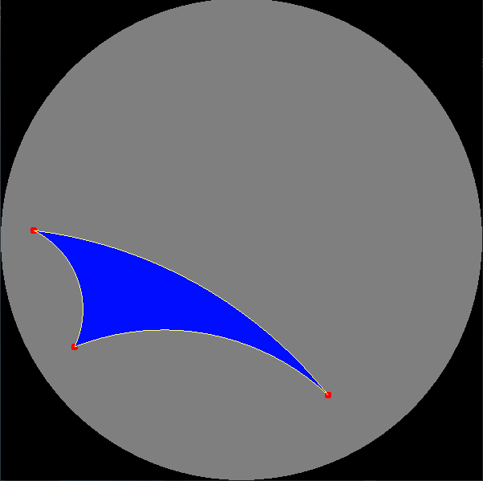

# Poincare-Triangle-Opengl
Draw a triangle on the Poincaré Disk using OpenGL.

# School assigment for Computer Graphics course 2020 Spring semester at BME

The program draws a triangle on the poincaré disk after three clicks, then colors the inside of the triangle using ear-clipping triangulation.

## Requirements

freeglut
glew 1.13.0
